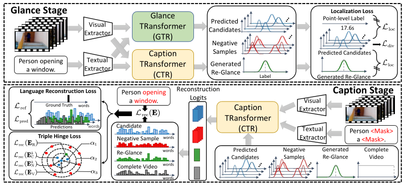
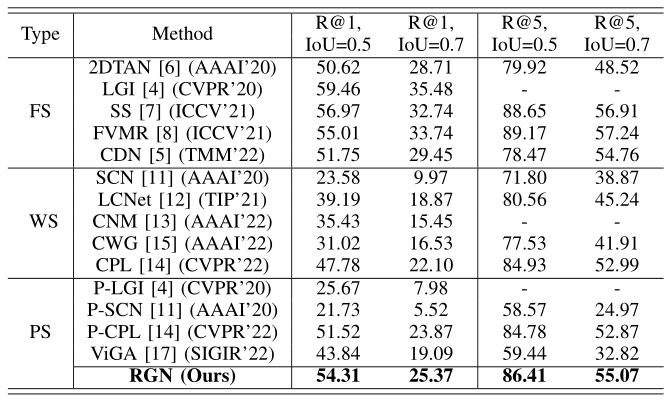
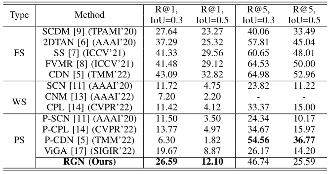
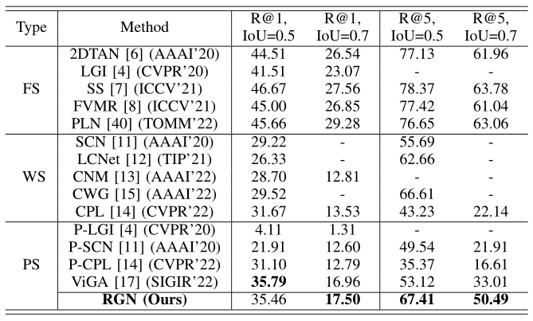
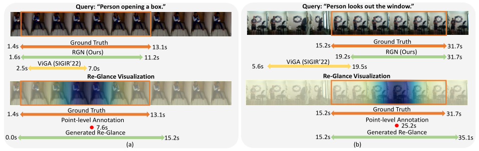

# Introduction

This is the implementation code and instruction of the proposed work  *"Learning Where to Learn: Re-Glance Networks for Point-Level Supervised Video Moment Retrieval"* (RGN).

## Re-Glance Networks

In this paper, we study a new paradigm of the Video Moment Retrieval task that has not been fully explored yet, i.e., Point-level Supervised VMR (PS-VMR), which asks for only point-level temporal annotations.  
We propose a novel transformer-based method for the PS-VMR task, termed Re-Glance Networks (RGN).
Specifically, it contains a Glance TRansformer, a Caption TRansformer, and a Glance-Caption framework consisting of (1) Glance Stage and (2) Caption Stage.  
During the Glance Stage, it predicts multiple Gaussian distributions as moment candidates and generate the re-glance area, a pseudo temporal supervision, to mine more temporal information.  
During the Caption Stage, it reconstructs the masked language query with the predicted candidates and re-glance, which guides the model to learn cross-modal alignments.  
The experimental results on three widely used VMR benchmarks, i.e., Charades-STA, TACoS, and ActivityNet-Caption, demonstrate our method establishes new state-of-the-art on the PS-VMR and achieves competitive performance compared with the FS-VMR task with fewer annotation costs.  



<!-- **Insight of Our Work** -->
## Insight of Our Work

1. We propose the novel RGN method that tackles the PS-VMR problem. It abandons inflexible designs in the previous PS-VMR method, thus effectively improving performance and efficiency.  
2. We design a Glance-Caption framework, which is based on a Glance TRansformer and a Caption TRansformer, to turn point-level supervision into area-level supervision, i.e., re-glance. It allows the model to learn more temporal information and more precise cross-modal alignments.  
3. To further boost the superiority of learning from re-glance, we deploy an effective triple hinge loss that guides the model to discriminate the redundant video content within video candidate moments.
4. Our RGN method outperforms recent state-of-the-art PS-VMR approaches. It also achieves competitive performance with less data costs compared with recent FS-VMR methods.  

# Data Preparation  

Please refer to [1](https://github.com/r-cui/ViGA) and [2](https://github.com/Alvin-Zeng/DRN) to download the off-the-shelf features.

# Training and Testing

## Running

Use the following command to train our model.

```Python
## Charades-STA
python train.py --config-path config/charades/i3d.json --tag RGN --log ./log/charades/
## activitynet
python train.py --config-path config/activitynet/c3d.json --tag RGN --log ./log/activitynet/
## TACoS
python train.py --config-path config/tacos/c3d.json --tag RGN --log ./log/tacos/
```

You can resume a checkpoint file by

```Python
python train.py --config-path config/charades/i3d.json --tag RGN --log ./log/charades/ --resume $checkpoint/charades/model-*.pt$ 
```

If you just want to evaluate a saved best model, use the following command.

```Python
python train.py --config-path config/charades/i3d.json --tag RGN --log ./log/charades/ --resume $checkpoint/charades/model-best.pt$ 
```

# Overall Results

<!-- **Results on Charades-STA Dataset** -->
## Results on Charades-STA Dataset



<!-- **Results on TACoS Dataset** -->
## Results on TACoS Dataset



<!-- **Results on ActivityNet-Caption Dataset** -->
## Results on ActivityNet-Caption Dataset



<!-- **Visualization of What Our Model Care** -->
## Visualization of Moment Retrieval and Re-Glance


